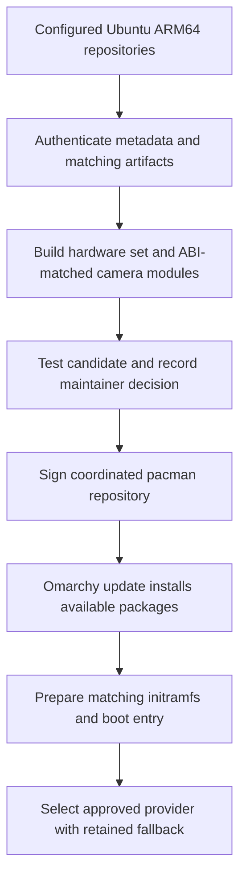

# What v0.2.0 changes for maintainers

v0.2.0 turns the working Snapdragon hardware integration into a package-managed
kernel lifecycle. The desktop is still Omarchy 4.0.3 and the selected Ubuntu
kernel is still 7.0.0-31-generic. The major change is how we acquire, package,
prepare and retain that hardware stack across installations and updates.

The owner reported a concrete success after a fresh v0.2.0 installation:
**after connecting to Wi-Fi, Omarchy's normal update flow ran and immediately
pulled the available updated packages.** That is physical evidence that the
installed system can participate in the ordinary online ARM package workflow.
The report does not include a package list or establish that a new Snapdragon
kernel was downloaded. The custom kernel repository in this ISO is still a
local signed snapshot.

## From a working image to an updateable hardware stack

| Area | v0.1 approach | v0.2.0 implementation and benefit |
| --- | --- | --- |
| Ubuntu inputs | Pinned extraction and packaging steps tied to a particular image/kernel | Candidate discovery reads the configured Ubuntu ARM64 repositories, authenticates metadata and artifact hashes, and resolves matching image, module and header packages. A maintainer can prepare another candidate using the same workflow. |
| Kernel binary | Preserve Ubuntu's working Stubble-wrapped image | Preserve the same binary while changing its packaging. We retain the device-tree selection work that makes these laptops boot, rather than maintaining a separate kernel fork. |
| Hardware identity | Kernel, firmware and board additions assembled as separate release inputs | A content-addressed hardware set binds the kernel, modules, firmware and rebuilt HP camera modules to one identity. Firmware-only changes also create a distinct set. |
| ABI-dependent drivers | HP camera integration matched to the pinned kernel | Matching Ubuntu headers are acquired and camera modules are rebuilt for the candidate ABI before packaging. This makes the dependency explicit. |
| Installed ownership | A fixed kernel and firmware namespace with bespoke boot finalization | Versioned `oma-snap-set-<id>` packages retain private module/firmware trees. The selected set is mounted read-only at runtime, so another installed set cannot silently supply its payloads. |
| Update preparation | Installation-focused initramfs and GRUB generation | Pacman hooks enqueue preparation; a service builds the candidate boot artifacts. Omarchy waits for preparation and checks its result between relevant update phases. |
| Activation | No general provider-controlled kernel selection | A small `oma-snap-kernel` provider identifies the explicitly approved set and channel. Activation records the approval sequence, keeps a fallback, and avoids undoing a manual rollback on a repeated update. |
| Recovery | Retain the original working image as the practical escape route | Keep kernel, modules, firmware and initramfs together for selectable fallback boots. Installed VM boots through kernel 30 → 31 → 30 verified the matching payloads and preserved the legacy boot files. |
| Package delivery | Custom integration largely shipped through the offline ISO | A coordinated signed repository contains the provider, hardware set, tools, Omarchy/settings pair and repository configuration. The installer seeds that repository into the installed system. |

The provider pattern separates hardware maintenance from the Omarchy desktop,
following the direction explored through Omarchy Mac. Snapdragon still uses
Ubuntu/Qualcomm hardware support; it does not use the Asahi kernel or Apple boot
stack. Targets remain Arch Linux ARM systems using pacman, not Ubuntu systems
running APT.

## How an update is intended to travel

Discovery and preparation do not imply approval. A newly published Ubuntu kernel
must not automatically become the default boot on users' laptops. The workflow
keeps source verification, candidate testing, maintainer approval and installed
activation as separate decisions.

The patched Omarchy runtime/settings pair is **4.0.3-1.9**. Its refresh templates
retain the Snapdragon repository and preparation helper. The earlier holds on
`omarchy` and `omarchy-settings` are removed; `hyprland`, `hyprtoolkit` and
`hyprland-guiutils` remain held, and the upstream Omarchy repository retains its
upgrade restriction. A successful update therefore means eligible packages
updated under the configured policy, not that all desktop compatibility holds
have been removed.

## Physical results and the limits of the claim

- The owner confirmed that the HP installed and ran v0.2.0 successfully.
- Direct camera previews work on both HP and ThinkPad. The initial Chromium
  failures are a browser-access issue to investigate later; permissions are a
  possibility, not an established cause. They are not a camera hardware failure.
- The owner reported the successful online Omarchy package update described
  above. No transaction inventory was collected for this documentation update.
- ASUS UX3407RA remains hardware-untested. ASUS A16/X2 work remains deferred.

The reproducibility result is for the retained hardware package, not a claim of
a fully reproducible ISO from a clean clone. The v0.2.0 testing decision explicitly
deferred the retained-candidate encrypted VM boot; the baseline encrypted VM
boot and different-ABI rollback tests passed separately. Approved-provider
runtime activation and a future kernel update on physical machines still need
specific validation. The existing VM remains paused; updating these documents
did not resume testing or change either laptop.

The ISO currently uses `file:///var/cache/oma-snap/repository` and a local test
signing key. A production public endpoint and trust transition are still needed
for remotely delivered Snapdragon kernel updates. Automatic pruning, legacy
package retirement, clean-build CI and complete interruption recovery are also
unfinished. Secure Boot is disabled and out of scope; package authenticity is a
separate concern.

The maintenance gain is substantial: the reusable pieces and ownership boundaries
now exist, and ordinary online package updates have a physical success report.
A maintainer can work on candidate validation and release delivery without
recreating the original hardware bring-up for each image.

See [release details](snapdragon-v0.2.0.md),
[approval and signing](kernel-promotion.md), and the
[pipeline implementation journal](kernel-update-pipeline.md).
